### Go 语言实现的命令行 debugger
> 参考：https://www.hitzhangjie.pro/debugger101.io/

TODO：参考 https://github.com/hitzhangjie/tinydbg 实现语句 debug
#### exec
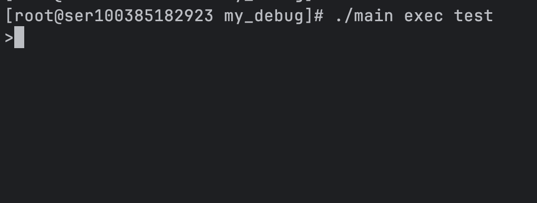 
自动新开进程作为调试进程，可以再代码开始处断点
#### attach
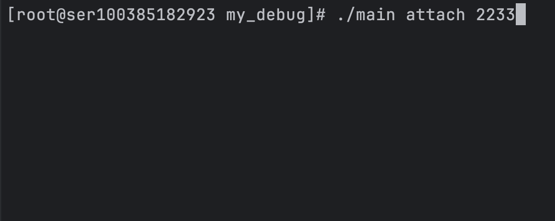 
附件调试进程到已有进程
#### disass
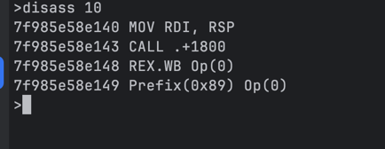 
反汇编当前 pc 指针后指定字节数的代码
#### break
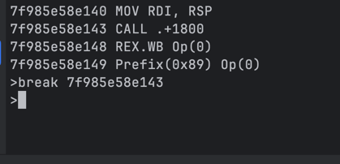 
在指定 pc 寄存器中设置断点
#### breaks
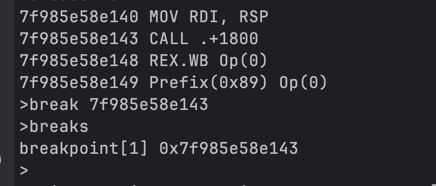 
查看当前所有断点
#### clear
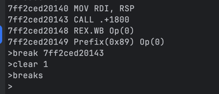 
清楚指定 id 的传断点，若是不指定，全部清楚
#### step
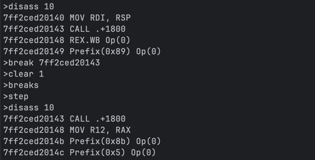 
单步执行
#### continue
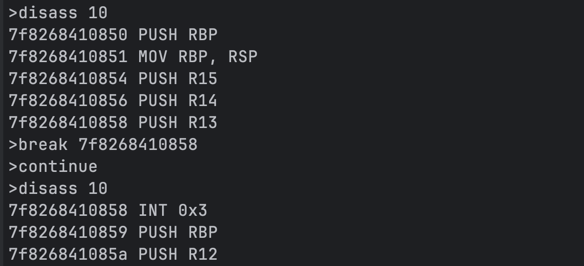 
直接执行到断点处
#### mem
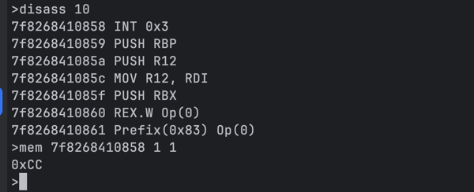 
查看内存（写入也是类似的）
#### regs
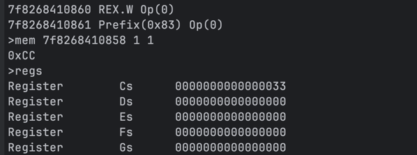 
查看寄存器（写入也是类似的）
#### exit
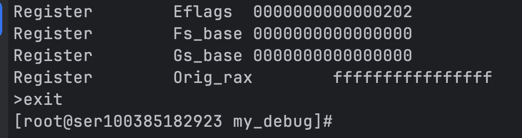 
退出调试器
